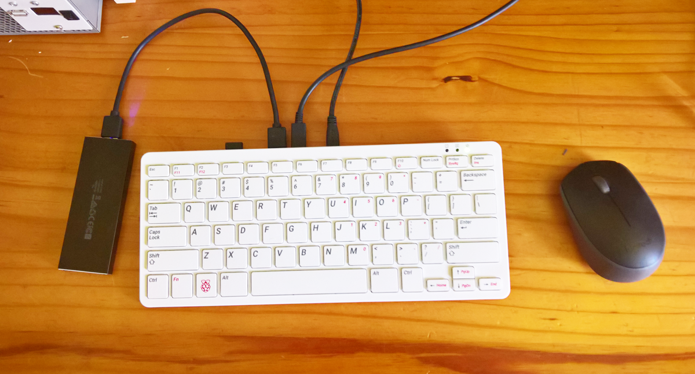
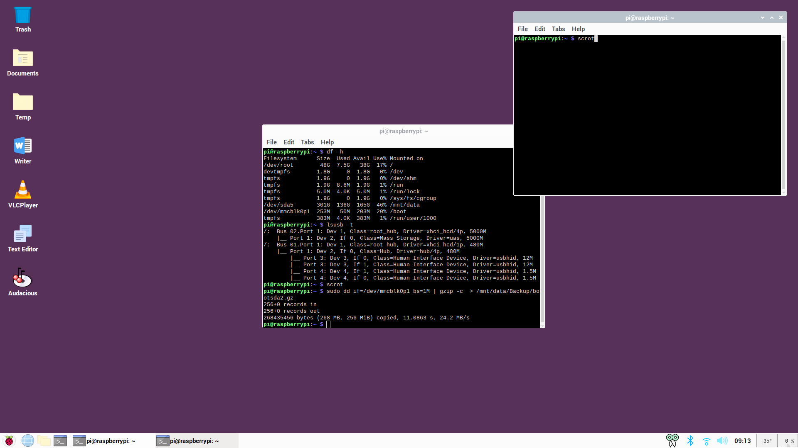

### The Raspberry Pi 400 
*Probably the most usable and affordable GPIO-enabled personal computer ever made. If you have read about it and are thinking of buying it do not wait - just buy it! (while [stocks](https://www.pishop.co.za/store/raspberry-pi-400) last..)*  

 Read some of the reviews and teardowns available on the internet such as [**Wired UK The Raspberry Pi 400 reinvents the microcomputer for 2020**](https://www.wired.co.uk/article/raspberry-pi-400-review), [**Jeff Geerling's**](https://www.jeffgeerling.com/blog/2020/raspberry-pi-400-teardown-and-review) and [**The Verge**](https://www.theverge.com/2020/11/2/21542278/raspberry-pi-400-keyboard-computer-arm-release-date-news-features) Reviews, and [**Elektor's An In-Depth Look at the Raspberry Pi 400**](https://www.elektormagazine.com/news/raspberry-pi-400-review). Also see the James Chambers [**Raspberry Pi 400 Overclocking and NVMe SSD Setup Guide**](https://jamesachambers.com/raspberry-pi-400-overclocking-ssd-setup-guide/).

  *The Rpi400 with an SDCard boot/SSD root and data drive, boots in 7 to 8 seconds to the desktop from powerup (and from 4 raspberries to the desktop is 3 to 4 seconds), and has a keyboard initiated true switch-off (and switch-on), i.e. USB peripherals such as an SSD are completely switched off.* [**Read more about my setup for using the RPi400.**](RPi400.md) 

     Also visit the official [**Raspberry Pi400 Home**](https://www.raspberrypi.org/products/raspberry-pi-400/) or read the  [**RPi400 MagPi Magazine Issue 101**](https://magpi.raspberrypi.org/issues/101). You may also be interested in [**HackSpace Magazine's**](https://hackspace.raspberrypi.org) special Pico [**issue 39**](https://hackspace.raspberrypi.org/issues/39)  and [**issue 40**](https://hackspace.raspberrypi.org/issues/40) . Or you can have the best of both - a combined [**RPi400-RPiPico**](https://github.com/Wren6991/Pi400-Pico-Plate)   
