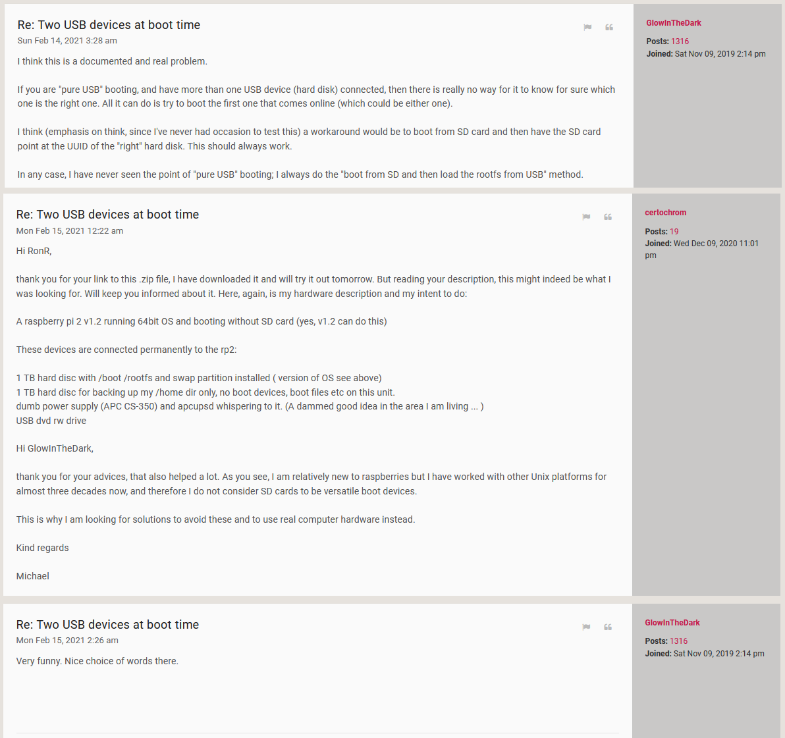

**Raspberry Pi 400:** To accommodate three other Raspberry Pi computers such as the Pi 400 or Pi 4B, whilst using only one medium-sized SSD in an M.2 external enclosure (also see note 1), the SSD was split into four partitions - three 50GB primary partitions for the Raspberry Pi root file system, and the rest as a 350GB FAT32 partition which stores media files, binaries and various Linux and Raspberry Pi related documents and reference material. Doing it this way enables me to plug the SSD into another (Intel-based) computer and then synchronize it with a primary data, documentation and media collection. All three Raspberry Pi computers [**still**](https://www.raspberrypi.org/forums/viewtopic.php?f=28&t=301409) use an  SDCard as the boot partition (see note 3), which then respectively boot /dev/sda1, /dev/sda2, and /dev/sda3. (Using device disk numbers rather than the partition’s UUID allows for the easy use of another SSD with the same partition scheme.) The three different Pi computers are a RPi 4B with an audio DAC (left picture below, and also see the last section [**here**](https://github.com/TobiasVanDyk/Raspberry-Pi-PC-PSU-Desktop-Computer-with-a-Hard-Disk-Drive-and-Fan-and-Switch)), a Raspberry Pi 400 (middle and right picture below), and another RPi 4B used to test SPI LCD displays, and programming the Pi Pico. 

I can then plug the drive into a windows PC and: 
1. Use [Macrium Reflect 8 Home Edition](https://forums.whirlpool.net.au/go?https%3A%2F%2Fdownload.macrium.com%2Freflect%2Fv8%2Fv8.0.7279%2Freflect_setup_free_x64.exe) (free), to make backups of the ext4 partitions 1 to 3. It is one of the few free Windows imaging programs that supports making ext4 partition images.
2. Use Windows Explorer or Western Digital SSD Dashboard to run for TRIM on the SSD (to do this in Linux refer to Note 2).
3. Use a synch program to update the data partition from the other PC - I use [SyncFolders](https://www.syncfolders.elementfx.com/home.html) (free).

  

 
  
 

**Note 1: Recommended M.2 SATA external enclosures**

The two M.2 SATA SSD to USB adapters that have been used with a Raspberry Pi 400 are as shown in the table below and in the two pictures left to right:

| Manufacturer | Chipset         | USB VID:PID | Cable Interface | Name and Link                                   |
|:-------------|:----------------|:------------|:----------------|:------------------------------------------------|
| Vantec       | ASMedia ASM1153 | 174c : 55aa | USB 3.0 Micro B | [NexStar SX NST-M2STS3-BK](https://www.vantecusa.com/products_detail.php?p_id=214) |
| Unitek       | VIA VL817       | 2109 : 0715 | USB C           | [Unitek M.2 SSD (NGFF/SATA) Aluminium Enclosure](https://www.unitek-products.com/products/usb3-0-m-2-ssd-ngff-sata-aluminium-enclosure) | 

 
   

The ASmedia ASM1153 and VIA VL817 - see [(a) ](https://spod.cx/blog/enabling_trim_support_via_VL817_usb_sata_adaptor.shtml)[(b) ](https://forum.odroid.com/viewtopic.php?t=31948)[(c)](https://usb-ids.gowdy.us/read/UD/2109/0715) both work at full USB 3 speed with UAS enabled. For more information see [Raspberry Pi 4 USB Boot Config Guide for SSD / Flash Drives](https://jamesachambers.com/raspberry-pi-4-usb-boot-config-guide-for-ssd-flash-drives/). Also refer to [this list of Raspberry Pi Forum posts](https://github.com/TobiasVanDyk/Raspberry-Pi-PC-PSU-Desktop-Computer-with-a-Hard-Disk-Drive-and-Fan-and-Switch/blob/master/RaspberryPi-USB-SSD-Boot.txt) about USB SSD/HDD boot problems and solutions.

**Note 2:** To enable SSD TRIM in linux follow the procedure here [**Enabling TRIM Support on a Via VL817 USB 3.1 SATA Adaptor**](https://spod.cx/blog/enabling_trim_support_via_VL817_usb_sata_adaptor.shtml): The udev rules and history for both chipsets are [**uploaded here**](https://github.com/TobiasVanDyk/Raspberry-Pi-PC-PSU-Desktop-Computer-with-a-Hard-Disk-Drive-and-Fan-and-Switch/tree/master/TRIMEnable).
1. **lsusb -t** Check that SSD supports **uas**
2. **sudo apt install sg3-utils** To enable **sg_vpd**
3. **sudo sg_vpd -a /dev/sda** Where sda is the SSD - check if **Unmap command supported (LBPU): 1** is present
4. **lsusb** Check chipset vendor and device id's: **ASMEDIA is 174c:55aa and VIA VL817 is 2109:0715**
5. **sudo nano /etc/udev/rules.d/50-uasp-usb.rules** Add this content and substitute vvvv and dddd with the vendor and device id: ACTION=="add|change", ATTRS{idVendor}=="vvvv", ATTRS{idProduct}=="dddd", SUBSYSTEM=="scsi_disk", ATTR{provisioning_mode}="unmap"
6. **sudo udevadm control --reload-rules && udevadm trigger** Better to reboot anyway
7. **sudo fstrim / --verbose** 
Note that I had to update the firmware on the ASMedia SSD enclosures to version **141126_A1_EE_82.bin** using the MPTool.exe before the TRIM command would work.

**Note 3:** *Unixers are never true Linuxers, and they are obviously also not Windowers, but they do like the Bee-ess-dee-ers...*

